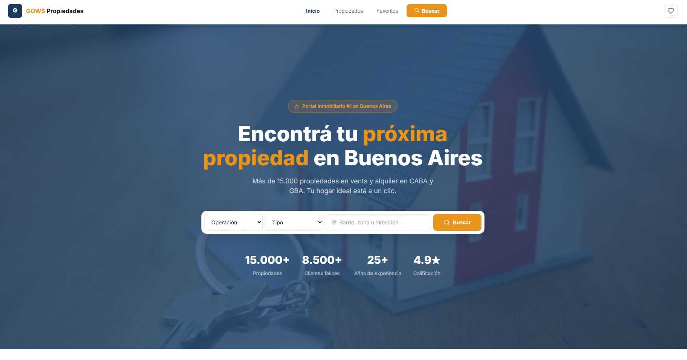

<div align="center">



<br/>
<br/>

# GOWS Propiedades - Portal Inmobiliario

**Plataforma de bienes raíces moderna para la búsqueda de propiedades en venta y alquiler.**

[](https://react.dev/)
[](https://vitejs.dev/)
[](https://lucide.dev/)

</div>

---

## 📋 Índice

- [Vista General](#-vista-general)
- [Funcionalidades](#-funcionalidades)
- [Stack Tecnológico](#-stack-tecnológico)
- [Instalación y Uso](#-instalación-y-uso)
- [Estructura del Proyecto](#-estructura-del-proyecto)
- [Autor](#-autor)

---

## 🖥️ Vista General

GOWS Propiedades es un portal inmobiliario de alta conversión construido con **React + Vite**, pensado como demo de portfolio premium para la agencia [GO Web Solutions](https://gows-web-oficial.vercel.app). Incluye un catálogo extenso de propiedades con filtrado avanzado, vista detallada con mapas integrados y gestión de favoritos persistente.

### ✨ Highlights

- 🔎 **Búsqueda Avanzada y Filtros** — filtrado por operación (venta/alquiler), tipo, ambientes y zonas.
- 🖼️ **Galería Interactiva** — slider de imágenes en la vista de detalle de cada propiedad.
- 🗺️ **Mapas Integrados** — mapa con ubicación exacta de la propiedad embebido mediante OpenStreetMap.
- ❤️ **Favoritos Persistentes** — sistema de "guardados" usando `localStorage` para no perder ninguna oportunidad.
- 📱 **Mobile First & Responsive** — experiencia fluida en cualquier dispositivo con menú adaptativo.
- ⚡ **Grid/List View** — alternancia entre vista de grilla y lista en el explorador de propiedades.
- 💬 **Integración WhatsApp** — botón de contacto directo para comunicarse rápidamente con un asesor inmobiliario.

---

## ⚡ Funcionalidades

### Búsqueda de Propiedades

| Feature         | Descripción                                                              |
| --------------- | ------------------------------------------------------------------------ |
| Explorador      | Catálogo paginado de propiedades con vista personalizable                |
| Filtros Sidebar | Selección múltiple de tipos y zonas, con reseteo rápido                  |
| Ordenamiento    | Por relevancia, precio o superficie                                      |
| Detalle         | Información completa, características, descripción y galería fotográfica |

### Experiencia de Usuario

| Módulo          | Funcionalidades                                                            |
| --------------- | -------------------------------------------------------------------------- |
| **Favoritos**   | Agregar/quitar, contador en tiempo real, vista separada para revisar       |
| **Contacto**    | Formulario en la vista de la propiedad y botón de acceso rápido a WhatsApp |
| **Animaciones** | Entradas sutiles, hover effects y micro-interacciones                      |

---

## 🛠️ Stack Tecnológico

```text
Frontend:
├── React 18          — Biblioteca de UI
├── Vite 5            — Bundler y dev server ultra-rápido
└── Lucide React      — Conjunto de íconos SVG consistentes y modernos

Arquitectura:
├── CSS Vanilla       — Sistema de tokens y utilidades en `index.css`
├── Custom Hooks      — `useFavorites.js` para manejo de localStorage
├── Módulo de Datos   — Dataset de propiedades simulado (`properties.js`)
```

**Sin dependencias CSS pesadas** — El diseño está construido de cero, garantizando ligereza, accesibilidad y máxima personalización.

---

## 🚀 Instalación y Uso

### Requisitos

- Node.js **18+**
- npm **9+**

### Pasos

```bash
# 1. Clonar el repositorio (si aplica) o navegar a la carpeta
cd gows-real-estate

# 2. Instalar dependencias
npm install

# 3. Levantar servidor de desarrollo local
npm run dev
# → http://localhost:5173

# 4. Build de producción (opcional)
npm run build
npm run preview
```

El proyecto ya está configurado para despliegue en Vercel mediante el archivo `vercel.json` incluido.

---

## 📁 Estructura del Proyecto

```text
gows-real-estate/
├── public/
│   └── favicon.svg           # Ícono SVG personalizado
├── src/
│   ├── components/
│   │   ├── Navbar.jsx        # Navegación y menú responsive
│   │   └── PropertyCard.jsx  # Tarjeta de propiedad reutilizable (Grid/List)
│   ├── data/
│   │   └── properties.js     # Datos mock de propiedades y agentes
│   ├── hooks/
│   │   └── useFavorites.js   # Hook custom para gestionar favoritos en localStorage
│   ├── pages/
│   │   ├── Home.jsx          # Landing principal con buscador y destacados
│   │   ├── Properties.jsx    # Catálogo principal con panel de filtros
│   │   ├── PropertyDetail.jsx# Vista detallada, mapa, galería y contacto
│   │   └── Favorites.jsx     # Página con lista de guardados
│   ├── App.jsx               # Enrutamiento lógico basado en estado
│   ├── index.css             # Estilos globales y design system
│   └── main.jsx              # Entry point React
├── package.json
├── vercel.json               # Configuración SPA para Vercel
└── vite.config.js
```

---

## 👤 Autor

**Gonzalo Orlandoni** — [GO Web Solutions](https://gows-web-oficial.vercel.app)

[](https://github.com/GonzaloOrlandoni)

---

<div align="center">

_Desarrollado con ❤️ por [GOWS Agency](https://gows-web-oficial.vercel.app)_

</div>
